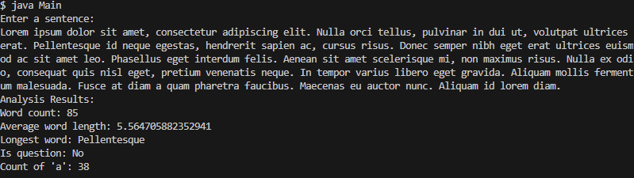

# Sentence Statistics Analyzer

## Overview

The Sentence Statistics Analyzer is a Java-based text analysis tool designed to process user-input sentences and generate insightful statistics. This application performs various analyses on a given sentence, providing useful metrics that can be valuable for text analysis, language processing, or educational purposes.

## Features

- Word count calculation
- Average word length computation
- Longest word identification
- Sentence type detection (question or statement)
- Specific letter occurrence counting (currently set to 'a')

## How to Run

1. Ensure you have Java installed on your system.
2. Compile the Java files:
   ```
   javac Main.java SentenceAnalyzer.java ResultFormatter.java
   ```
3. Run the program:
   ```
   java Main
   ```
4. Enter a sentence when prompted.
5. View the analysis results.

## Project Structure

- `Main.java`: Contains the main method and handles user input/output
- `SentenceAnalyzer.java`: Implements the core analysis logic
- `ResultFormatter.java`: Formats the analysis results for display

## Example Output



## Technical Details

This project is implemented in Java and focuses on fundamental programming concepts such as:

- String manipulation
- Array processing
- Basic input/output operations
- Simple statistical calculations
